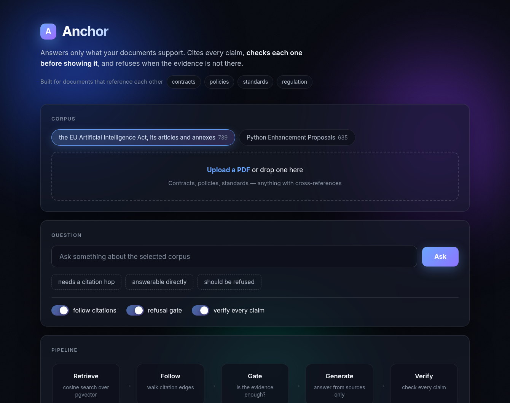
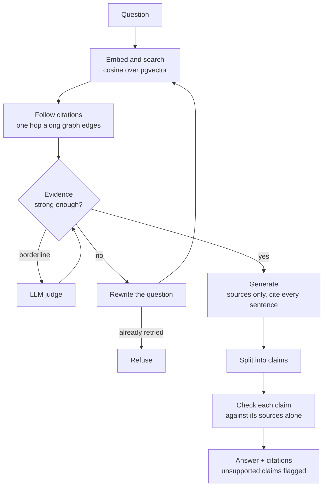

# Anchor

**A retrieval engine that refuses to answer beyond its evidence.**

Point it at a set of documents. Ask a question. It answers using only the retrieved text, puts
a citation on every claim, verifies each claim against its source before returning it, and says
so plainly when the documents don't cover your question.

---

## The problem, concretely

Say you work at a company shipping a CV screening tool into Europe, and someone asks:
**"does the EU AI Act classify what we built as high risk?"**

That answer is worth getting right and expensive to get wrong. So you point an LLM at the
regulation. Three things go wrong, and none of them are visible in the output:

1. **The model already knows a bit about the AI Act from training.** It will answer confidently
   whether or not your retrieval found anything relevant, and the answer *looks* the same either
   way.
2. **The answer is split across two documents that share no vocabulary.** Article 6 says a
   system is high risk if it appears in Annex III. The employment entry in Annex III is what
   actually answers you — and it never uses the words "CV" or "screening". Vector search scores
   it below documents that merely *discuss* high-risk systems.
3. **When retrieval comes back with nothing useful, the pipeline answers anyway**, because
   nothing in it is allowed to say "I don't know."

Anchor is what the pipeline looks like once you've fixed those three. **Retrieval decides what
the model is allowed to see; verification decides what it is allowed to say.**

### Where this shape of problem shows up

The AI Act is the demo corpus, not the point. The engine is built for **documents that reference
each other**, which is most documents worth asking questions about:

- **Contracts.** "Subject to the limitations in Section 7.2", "as defined in Schedule A". A
  clause read without the thing it points at is how contract review goes wrong.
- **Insurance policies.** The exclusion that matters is three cross-references away from the
  cover you asked about.
- **Technical standards.** RFCs and ISO documents cite each other constantly; RFC 9110 was the
  first corpus I tried.
- **Internal policy and compliance manuals**, where the rule and its exception are written in
  different documents by different teams.

In all of them, similarity search retrieves the clause that *mentions* your topic and misses the
one that *governs* it. That is the problem this is built around, and switching corpora means
writing one adapter class.

---

## What it looks like



The interface is deliberately not a chat box. **The pipeline reports each stage as it reaches
it, the API streams those over server-sent events, and the diagram lights up as they arrive** —
so you watch the retrieve, the citation hop, the gate's decision and the claim checks happen
rather than staring at a spinner for ten seconds.

A node glows while it runs and shows what it is doing, turns green with its result
(`8 chunks, best score 0.74`), and turns red on a refusal. When the gate rejects weak evidence
and triggers a rewrite, you see Gate go red and Retrieve fire a second time.

The toggles switch stages off, so the difference the citation hop makes is something you can
demonstrate rather than describe.

```bash
uvicorn anchor.api:app        # then open localhost:8000
```

Server-sent events rather than a websocket because the data only flows one way, server to
browser. SSE is plain HTTP, reconnects by itself, and is about six lines in the page.

On the command line:

```
$ anchor ask "Is an AI system used to evaluate job applicants considered high risk?"

Yes. An AI system that is used to evaluate job applicants falls within the high-risk
category for employment, recruitment and selection of natural persons [1]

checked 1 statements, 0 not supported

sources
  [1] Annex III(4)   score 0.74
      High-risk AI systems pursuant to Article 6(2) are the AI systems listed in any of
      the following areas: Employment, workers' management and access to self-employment:
      (a) AI systems intended to be used for the recruitment or selection of natural...
  [5] Article 3(65)  score 0.55 (followed from Annex III(4))

what it did
  retrieved 5 chunks, best score 0.74
  followed citations into Article 3(65)
  gate: passed on score alone (0.74)
  checked 1 statements, 0 unsupported
```

And when the corpus can't answer it — here the question is about the GDPR, a different
regulation entirely:

```
$ anchor ask "What is the maximum fine under the GDPR for unlawful profiling?"

I don't have enough in the sources to answer that.
reason: the sources were retrieved but do not answer it

what it did
  retrieved 5 chunks, best score 0.55
  gate: passed on score alone (0.55)
  the writer refused after reading the sources
```

---

## Why it exists

The first version of any RAG project is easy. Embed some chunks, search by cosine similarity,
paste the top five into a prompt, print whatever comes back. That works often enough to demo,
and it fails in ways you cannot see — which is worse than failing loudly.

Three failures kept showing up while testing a plain pipeline. Each one became a piece of this
design.

**The model answers from memory instead of from the documents.** Ask about something it saw
during pretraining and it produces a fluent, confident, sometimes correct answer with no
relationship to what retrieval returned. You cannot tell by reading the output. So every claim
gets checked against the retrieved text, rather than trusting citation markers the model wrote
itself.

**Similarity search cannot follow a reference.** Documents cite each other constantly. An
article of the EU AI Act says a system is high risk if it is listed in Annex III, and the text
you need sits in a different document sharing almost no vocabulary with the question. Cosine
similarity will never surface it. So ingest builds a citation graph and retrieval walks it.

**A plain pipeline has no way to say no.** If retrieval returns garbage the prompt still gets
filled and the model still writes something. So the evidence is scored before generating, and
the question is rewritten once before the system gives up.

---

## How it works



**Ingest** splits a corpus into units that follow the document's own structure — a numbered
paragraph of an article, not a fixed 1000 characters — embeds them into Postgres with pgvector,
and records which unit cites which. The citation graph comes free with the parse.

**Retrieval** searches by cosine distance, then pulls in what the strongest hits reference.
Followed text cannot win on similarity — it inherits a decayed copy of its parent's score, so
by construction it never outranks its parent. Reserved context slots solve that, and total
context size stays constant either way, which is what makes the comparison below meaningful.

**The gate** runs a cheap distance check first; only borderline cases cost a model call. On
failure the model rewrites its own question and retrieval runs again, capped at one retry.

**Verification** decomposes the answer into atomic claims and puts each one back in front of
the sources alone, without the rest of the answer around it making it sound plausible.

---

## Results

Two corpora, to show the engine isn't tied to one dataset. The EU AI Act (739 chunks, 126
units, 402 citation edges) and Python PEPs (635 chunks, 60 units, 235 edges). Only an adapter
class differs between them.

Questions come in three kinds: answerable from one unit, needing a reference followed, and
genuinely unanswerable. Every gold label was verified against the actual document text.

### Retrieval

Free to run — embeddings and SQL, no model calls.

| chunking | k | hop | single-hop | multi-hop | overall |
|---|:-:|:-:|:-:|:-:|:-:|
| structural | 5 | no | 1.00 | 0.70 | 0.86 |
| structural | 5 | yes | 0.92 | 1.00 | 0.95 |
| **structural** | **8** | **yes** | **1.00** | **1.00** | **1.00** |
| structural | 3 | no | 0.92 | 0.60 | 0.77 |
| structural | 3 | yes | 0.92 | 1.00 | 0.95 |
| fixed-size | 5 | no | 0.92 | 0.80 | 0.86 |

Following citations takes multi-hop retrieval from **0.70 to 1.00** on the AI Act, and from
**0.00 to 1.00** on the PEPs. The three AI Act questions it rescues are the same shape every
time: plain retrieval found the article that *points at* the answer and stopped. Asked which
criminal offences permit real-time biometric identification, it returned Article 5 three times
over — the list of offences is in Annex II.

It is not free. At k=5 a reserved slot displaces a direct hit and single-hop drops to 0.92. At
k=8 there is room for both. `k=8` is the default because of this table, not because it was
guessed.

> **k=3 with the hop beats k=8 without it** — 0.95 against 0.86, on under half the context.
> Following one reference is worth more than five extra chunks of similar text.

### Generation

Same writer model, same metric, k=5 throughout.

| config | single | multi-hop | correct refusals | false refusals | faithful | tokens/q |
|---|:-:|:-:|:-:|:-:|:-:|:-:|
| naive | 1.00 | 0.70 | 0.625 | 0.045 | 0.975 | 2,500 |
| plain | 1.00 | 0.70 | 1.00 | 0.136 | 1.00 | 1,914 |
| fixed-size | 0.92 | 0.80 | 1.00 | 0.045 | 0.943 | 2,737 |
| hop | 0.92 | 1.00 | 1.00 | 0.091 | 0.944 | 2,150 |
| hop+gate | 0.92 | 1.00 | 1.00 | 0.091 | 0.944 | 2,208 |
| full | 0.92 | 1.00 | 1.00 | 0.091 | 0.958 | 6,823 |

`naive` has no instruction to stay inside the sources and no way to refuse — a pipeline where
retrieval is treated as the whole job. **The grounding instruction takes correct refusals from
0.625 to 1.00**, answering three of eight unanswerable questions otherwise. The cost, stated in
the same breath: false refusals rise from 0.045 to 0.136.

The hop *reduces* false refusals, 0.136 to 0.091. Better evidence means fewer questions the
model can't find enough to answer.

### The result I did not expect

The full config decomposed 20 answers into 67 claims and found **12 unsupported by the
retrieved text — 18%.** On the PEPs, 5 of 22 — **23%**. Two unrelated corpora in the same range.

That is with the grounding prompt and the refusal gate both active, and an answer-level
faithfulness judge scoring those same answers at 0.958.

Those two measurements disagree, and the disagreement is the point. A judge reading a whole
answer sees something mostly grounded and calls it grounded. Decomposing it catches the one
sentence in five that drifted past what the sources say. **Grounding prompts and refusal gates
are not sufficient on their own** — a narrower claim than "this prevents hallucination", and
one that can actually be defended.

### How much to trust the faithfulness numbers

There are no human labels anywhere in this evaluation. Faithfulness is one model's opinion of
another model's output. What `eval/calibrate.py` measures is whether independent judges agree:

| comparison | claims | agreement |
|---|:-:|:-:|
| pipeline checker vs second judge | 58 | 78% |
| pipeline checker vs third judge (different provider) | 20 | 80% |
| second vs third judge | 20 | 90% |
| all three agreed | 20 | 70% |

Around 78–80% is a reasonable place to land: stable enough that a difference between two
configurations means something, not so stable that any single number should be quoted as fact.
**Agreement is not accuracy.** Three models agreeing means they read the evidence the same way,
not that they read it correctly.

The disagreements are readable. Most are the pipeline's checker being stricter than the others
on claims that paraphrase a provision rather than restate it — it wants the words present, the
others accept the sense. For a compliance system that is arguably the right bias, but it is a
bias, and it means the 18% figure should be read as an upper bound.

---

## Running it

```bash
docker compose up -d                      # Postgres + pgvector
pip install -r requirements.txt
cp .env.example .env                      # add a Groq key. Several are supported.

python -m anchor.cli ingest aiact         # ~4 min first time, cached after

uvicorn anchor.api:app                    # the UI, at localhost:8000
python -m anchor.cli ask "Which AI practices does the Regulation prohibit?"   # or the CLI
```

| command | what it does |
|---|---|
| `anchor.cli ask` | answer a question, with citations and the trace of what it did |
| `anchor.cli retrieve` | show what came back and what was followed, without generating |
| `anchor.cli assess` | describe a system in plain English, get the obligations that apply |
| `anchor.cli ingest` | pull a corpus through its adapter and build the citation graph |
| `eval.sweep` | retrieval parameter sweep — free, no model calls |
| `eval.run_eval` | the full ablation across pipeline configurations |
| `eval.calibrate` | how much the faithfulness judge can be trusted |
| `uvicorn anchor.api:app` | the UI at `/`, plus `/ask`, `/assess` and `/ask/stream` |

`anchor.api` serves the UI at `/` and three endpoints: `/ask` and `/assess` return JSON once
they are done, and `/ask/stream` reports each stage of the pipeline as it reaches it.

**Adding a corpus** means one adapter class answering three questions: where the documents
live, how one splits into units, and what a reference to another unit looks like in the text.
Everything downstream is corpus-blind.

---

## Built with

Python · FastAPI · PostgreSQL + pgvector (HNSW, cosine) · sentence-transformers
(`all-MiniLM-L6-v2`, 384 dims) · Groq (`gpt-oss-120b` writes, `gpt-oss-20b` judges) · Gemini
(independent evaluation judge only) · Docker

About 1,800 lines. No LangChain or LlamaIndex — deliberately. Every retrieval decision, prompt
and threshold is visible and changeable, which is the point.

---

## What it doesn't do

- **One hop only.** If the answer is two references away, it isn't found.
- **No reranker.** A cross-encoder over the retrieved set is the obvious next improvement and
  would probably beat the hop on single-hop questions.
- **Recitals of the AI Act are excluded.** They explain the reasoning behind the law but are not
  the law, and they triple the corpus with text that sounds authoritative without being binding.
- **30 questions, written by one person.** Enough to compare configurations against each other,
  not enough to claim anything about absolute quality. At k=8 with the hop the set is saturated
  at 1.00 and can no longer distinguish improvements — the next version needs harder questions,
  not more mechanisms.
- **`all-MiniLM-L6-v2` is small and old.** Chosen because it is free, local, and fast enough to
  re-embed the whole corpus in under a minute while iterating.
- **The third calibration judge samples 20 of 67 claims**, because its free tier allows twenty
  requests a day.

---

## Where this goes next

In order, and the first one gates the rest.

**Harder evaluation questions.** At k=8 with the citation hop the eval set scores 1.00 across the
board. That is not a success, it is a measurement problem: a saturated set cannot tell me whether
the next change helped. Everything below is unmeasurable until this is fixed, so it goes first.
Concretely that means questions needing two references followed, questions where the right answer
is a specific sub-clause rather than an article, and more unanswerable ones that look answerable.

**A cross-encoder reranker.** Right now the question and a chunk are embedded separately and
compared. A cross-encoder reads them together and is substantially better at ordering the top
results. I would expect it to beat the citation hop on single-hop questions and do nothing for
multi-hop ones — a reranker still cannot surface a document retrieval never returned. Worth
building partly to find out whether that prediction is right.

**Multi-hop traversal.** One hop finds a document the answer cites. It does not find a document
*that* document cites. The reason it is not built is retrieval noise: every hop multiplies the
candidate set and the connection to the question gets weaker. Doing it properly means weighting
paths by something better than a flat decay, and the eval set cannot currently tell me whether
any of it worked.

**Semantic edges, not just structural ones.** Today an edge means "this article cites that one",
pulled out with a regex. The richer version is "this obligation applies to that actor", "this
definition constrains that provision" — extracted with a model, stored as a typed graph. That is
the point where a graph database earns its place over a join table.

**Permission-filtered retrieval.** For any real deployment the retriever has to filter by the
caller's permissions *before* ranking, not after. A retrieval system over internal documents that
ignores who is asking is a data leak with a chat interface. Not built, and I would not ship this
inside a company without it.

**Human labels.** Every faithfulness number here is model-judged, and three judges agreeing tells
me the signal is stable, not that it is correct. A few hundred hand-labelled claims would turn
the agreement number into an accuracy number, and would also tell me which of the three judges to
trust when they disagree.

## What broke

The most useful part of this project. None of these threw an error.

**A regex ate a fifth of the citation graph.** `\bAnnexes?` does not mean "Annex" with an
optional "s" — `?` binds to the preceding character, so it matched "Annexe" and "Annexes" and
never the singular that appears everywhere. No crash, just a graph quietly missing every
single-annex reference.

**The citation hop did nothing for its first implementation.** Followed chunks inherit a decayed
copy of their parent's score, so sorting the merged set by score threw away everything the hop
had found. Output was byte-identical with the feature on and off.

**The chunk that talked about the topic beat the chunk that answered it.** Asked whether CV
screening is high risk, retrieval returned Annex III's *header* at 0.588 and the employment
provision that answers it at 0.531. The header repeats the question's vocabulary; the answer
doesn't. Folding list lead-ins into their items and putting unit headings into the embedding
moved it to 0.74 and rank one.

**A metric measured a prompt's vocabulary instead of behaviour.** Refusal was detected by
checking for the string `NOT IN SOURCES` — the exact phrase the grounding prompt tells the model
to emit. That worked until a baseline with no such instruction was added, which declined in its
own words and was scored as having answered. The metric agreed with expectations across four
configurations before the fifth exposed it. Every earlier number was thrown away and re-measured.

**And the calibration produced a confident, plausible, completely wrong result.** It rebuilt
"the sources" a judge should grade against by taking one chunk per retrieved unit, with no
ordering. Article 99 has nineteen paragraphs; the answer had been written from the one containing
the fine, and the reconstruction handed over the first. Every judge but the pipeline's own was
grading against evidence that did not contain the answer. They said unsupported, agreed with
each other at 94%, and that agreement looked like confirmation.

> Two measurements agreeing is not evidence they are correct. It is evidence they share an input.

The eval now records exact chunk ids and rebuilds from those. Agreement went from 28% to 78%.
