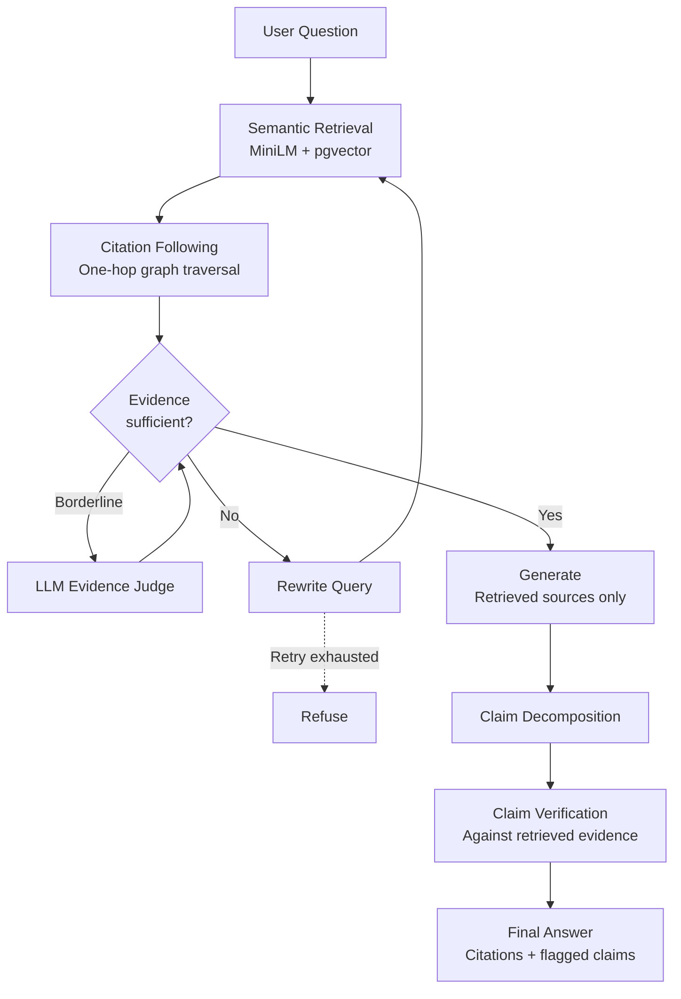

# Anchor

### Grounded RAG for document-heavy questions

**Anchor is a retrieval and verification pipeline designed to answer from evidence, not from the model's memory.**

Point it at a document corpus, ask a question, and Anchor:

- retrieves relevant evidence
- follows explicit cross-references between document units
- decides whether the evidence is strong enough to answer
- generates only from the retrieved sources
- verifies the factual claims in the generated answer
- refuses when the corpus does not provide enough support

> **Retrieval decides what the model is allowed to see.  
> Verification decides what the model is allowed to say.**

---

## Why Anchor?

A basic RAG pipeline is deceptively simple:

`embed → retrieve top-k chunks → prompt the LLM → return the answer`

That works until the question depends on something retrieval did not directly surface.

For example, the EU AI Act can say that a system is high-risk if it appears in **Annex III**, while the actual employment-related system is described inside that annex. A semantic search for "CV screening" can rank a general discussion of high-risk systems above the provision that actually answers the question.

There are three problems Anchor is designed around:

1. **LLM memory**  
   A model can answer from its pretrained knowledge even when retrieval did not provide the answer.

2. **Cross-references**  
   The evidence may live behind an explicit reference rather than in a semantically similar chunk.

3. **No-answer decisions**  
   A conventional RAG pipeline often has no robust mechanism for saying *"the retrieved evidence is not enough."*

Anchor addresses all three.

---

## Where this can be useful

The EU AI Act is the main demo corpus, but the architecture is designed for documents that reference one another.

- **Contracts**  
  A clause may depend on a definition or schedule somewhere else.

- **Insurance policies**  
  The relevant exclusion may be several references away from the coverage being asked about.

- **Technical standards**  
  RFCs and other standards frequently reference external provisions.

- **Internal policy and compliance documents**  
  Rules, definitions, and exceptions may live in different documents.

In these settings, saying **"I don't have enough evidence to answer"** can be much better than confidently making an unsupported claim.

---

## Architecture



### Ingest

Each corpus is parsed according to its own structure rather than being split blindly into fixed-size windows.

The ingester:

- creates structural document units
- embeds them
- stores them in PostgreSQL with pgvector
- extracts references between units
- builds the citation graph

Adding a new corpus means implementing one adapter that answers:

1. Where are the documents?
2. How should they be split into units?
3. What does a reference to another unit look like?

Everything downstream is corpus-blind.

### Retrieval

Anchor uses `all-MiniLM-L6-v2` embeddings and cosine similarity over pgvector.

After the initial semantic search, it follows explicit citation edges by one hop. Followed chunks inherit a decayed score from their parent and receive reserved context slots so that the citation hop is not immediately discarded by score sorting.

### Evidence gate

Before generation, the retrieved evidence goes through a gate.

- Strong evidence proceeds directly.
- Borderline evidence is checked by a small LLM judge.
- Weak evidence triggers one query rewrite and another retrieval attempt.
- If the retry still fails, Anchor refuses.

The goal is not to guarantee that an answer can never be wrong. It is to make **insufficient evidence a first-class outcome**.

### Claim verification

The generated answer is decomposed into individual factual claims.

Each claim is checked against the retrieved evidence rather than trusting the citation marker generated by the model.

Unsupported claims are flagged before the answer is returned.

---

## What it looks like


The UI is intentionally more like a pipeline trace than a normal chat box.

Each stage reports what it is doing through **Server-Sent Events (SSE)**:

`retrieve → citation hop → gate → generate → verify`

The interface makes retrieval decisions, refusals, rewrites, and claim checks visible instead of hiding everything behind a loading spinner.

---

## Example

### Answerable question

```text
$ anchor ask "Is an AI system used to evaluate job applicants considered high risk?"

Yes. An AI system that is used to evaluate job applicants falls within
the high-risk category for employment, recruitment and selection of
natural persons [1]

checked 1 statements, 0 not supported

sources
  [1] Annex III(4)   score 0.74
      High-risk AI systems pursuant to Article 6(2) are the AI systems
      listed in any of the following areas: Employment, workers'
      management and access to self-employment...

  [5] Article 3(65)  score 0.55
      (followed from Annex III(4))

what it did
  retrieved 5 chunks, best score 0.74
  followed citations into Article 3(65)
  gate: passed on score alone (0.74)
  checked 1 statements, 0 unsupported
```

### Unanswerable question

```text
$ anchor ask "What is the maximum fine under the GDPR for unlawful profiling?"

I don't have enough in the sources to answer that.

reason: the sources were retrieved but do not answer it

what it did
  retrieved 5 chunks, best score 0.55
  gate: passed on score alone (0.55)
  the writer refused after reading the sources
```

---

## Results

Anchor was evaluated on two corpora to check that the retrieval architecture was not tied to one dataset:

| Corpus | Chunks | Structural units | Citation edges |
|---|---:|---:|---:|
| EU AI Act | 739 | 126 | 402 |
| Python PEPs | 635 | 60 | 235 |

The evaluation set contains answerable single-hop questions, questions requiring citation following, and deliberately unanswerable questions.

### Retrieval

The retrieval sweep uses embeddings and SQL only, so it does not require model calls.

| Chunking | k | Citation hop | Single-hop | Multi-hop | Overall |
|---|---:|:---:|---:|---:|---:|
| Structural | 5 | No | 1.00 | 0.70 | 0.86 |
| Structural | 5 | Yes | 0.92 | **1.00** | **0.95** |
| **Structural** | **8** | **Yes** | **1.00** | **1.00** | **1.00** |
| Structural | 3 | No | 0.92 | 0.60 | 0.77 |
| Structural | 3 | Yes | 0.92 | **1.00** | **0.95** |
| Fixed-size | 5 | No | 0.92 | 0.80 | 0.86 |

Citation following improved multi-hop retrieval from **0.70 to 1.00** on the AI Act and from **0.00 to 1.00** on the PEPs.

One interesting result:

> **k=3 with citation following scored 0.95 overall, compared with 0.86 for plain retrieval at k=8.**

The important point is not simply "fewer tokens." It shows that following the right reference can be more useful than adding more semantically similar chunks.

### Generation ablation

The same writer model was used across configurations.

| Configuration | Single | Multi-hop | Correct refusals | False refusals | Faithful |
|---|---:|---:|---:|---:|---:|
| Naive | 1.00 | 0.70 | 0.625 | 0.045 | 0.975 |
| Plain | 1.00 | 0.70 | 1.00 | 0.136 | 1.00 |
| Fixed-size | 0.92 | 0.80 | 1.00 | 0.045 | 0.943 |
| Hop | 0.92 | **1.00** | 1.00 | 0.091 | 0.944 |
| Hop + gate | 0.92 | **1.00** | 1.00 | 0.091 | 0.944 |
| Full | 0.92 | **1.00** | 1.00 | 0.091 | **0.958** |

The full pipeline decomposed 20 answers into 67 claims and found **12 unsupported claims** in the AI Act evaluation, about 18%.

For PEPs, it found **5 unsupported claims out of 22**, about 23%.

These numbers are model-judged, not human-verified ground truth. They are useful signals for comparing configurations, but they should not be treated as absolute accuracy measurements.

### Evaluation calibration

One of the more important findings was that **agreement is not the same as accuracy**.

Independent judge agreement landed around 78–90% depending on the comparison. That is useful evidence that the signal is reasonably stable, but it does not prove that the judges are correct.

---

## What broke

This project became much more interesting once things started breaking.

### The citation hop initially did nothing

Followed chunks inherited a decayed score from their parent, but the merged results were globally sorted again. The followed evidence was therefore often discarded.

With the feature enabled and disabled, the output was byte-identical.

**Fix:** reserve context slots for followed chunks while keeping the total context size constant.

### The chunk that mentioned the topic beat the chunk that answered it

For a CV-screening question, an Annex III header scored around **0.588**, while the employment provision that actually answered the question scored around **0.531**.

The header had more vocabulary overlap.

**Fix:** preserve structural lead-ins and include unit headings in the embedding representation. The relevant provision moved to roughly **0.74 and rank 1**.

### The refusal metric measured a phrase, not behaviour

The first evaluation checked whether the model literally returned `NOT IN SOURCES`.

A baseline without that instruction refused using different wording and was incorrectly scored as an answer.

**Fix:** replace the magic-string check with a model-judged refusal metric and discard the earlier results.

### Calibration produced a convincing wrong result

The calibration pipeline reconstructed source evidence incorrectly by taking one chunk per retrieved unit. For documents with many paragraphs, that could hand the judge a different chunk from the one actually used.

Multiple judges agreed on the wrong evidence.

**Fix:** record and reconstruct exact chunk IDs.

The lesson:

> **Two measurements agreeing is not evidence that they are correct. It can simply mean they share the same wrong input.**

---

## Running it locally

### Requirements

- Python
- Docker
- A Groq API key
- PostgreSQL + pgvector via Docker Compose

### Setup

```bash
docker compose up -d

pip install -r requirements.txt

cp .env.example .env
# Add your Groq key to .env
```

Ingest the EU AI Act corpus:

```bash
python -m anchor.cli ingest aiact
```

Start the API and UI:

```bash
uvicorn anchor.api:app
```

Then open:

```text
http://localhost:8000
```

Or use the CLI:

```bash
python -m anchor.cli ask "Which AI practices does the Regulation prohibit?"
```

### Useful commands

| Command | Purpose |
|---|---|
| `anchor.cli ask` | Answer a question with citations and a pipeline trace |
| `anchor.cli retrieve` | Inspect retrieval and citation following without generation |
| `anchor.cli assess` | Describe a system and identify applicable obligations |
| `anchor.cli ingest` | Ingest a corpus and build its citation graph |
| `eval.sweep` | Run retrieval parameter sweeps without model calls |
| `eval.run_eval` | Run the generation ablation |
| `eval.calibrate` | Measure agreement between faithfulness judges |

---

## Tech stack

**Backend:** Python, FastAPI  
**Database:** PostgreSQL, pgvector, HNSW  
**Embeddings:** `all-MiniLM-L6-v2` (384 dimensions)  
**LLMs:** Groq (`gpt-oss-120b`, `gpt-oss-20b`)  
**Evaluation:** Independent judge model  
**Infrastructure:** Docker Compose  
**Streaming:** Server-Sent Events

The project is roughly **1,800 lines of code**.

There is intentionally no LangChain or LlamaIndex. The retrieval logic, prompts, thresholds, evaluation code, and verification flow are explicit and inspectable.

---

## Limitations

Anchor is a learning and research project, not a production compliance system.

Current limitations include:

- **One-hop citation traversal.** It does not yet follow chains of references beyond one hop.
- **No cross-encoder reranker.** Retrieval currently relies on embedding similarity plus citation following.
- **Small evaluation set.** The current set is useful for comparing configurations, but not for making broad quality claims.
- **Model-judged faithfulness.** Human-labelled claims would provide a stronger evaluation baseline.
- **Small embedding model.** `all-MiniLM-L6-v2` was chosen because it is local, fast, and free to iterate with.
- **No permission-aware retrieval.** A real deployment over private documents would need authorization filtering before retrieval/ranking.
- **No guarantee of hallucination-free output.** Verification and refusal mechanisms reduce unsupported answers, but they do not make an LLM infallible.

---

## Next steps

1. **Harder evaluation questions**  
   Two-hop questions, specific sub-clause questions, and unanswerable questions that look answerable.

2. **Cross-encoder reranking**  
   Improve ordering of the initial semantic candidates.

3. **Multi-hop traversal**  
   Follow deeper reference chains while controlling retrieval noise.

4. **Typed semantic edges**  
   Move beyond "A cites B" toward relationships such as "obligation applies to actor" or "definition constrains provision."

5. **Permission-filtered retrieval**  
   Enforce document access before ranking in any real deployment.

6. **Human-labelled evaluation**  
   Replace model-only faithfulness signals with a smaller but genuinely labelled benchmark.

---

## Repository structure

```text
anchor/
├── config.py       # Settings, thresholds, model routing
├── fetch.py        # Cached document downloading
├── corpora.py      # Corpus adapters
├── store.py        # Embeddings, schema and ingestion
├── retrieve.py     # Semantic retrieval + citation following
├── llm.py          # Model calls, retries and JSON repair
├── prompts.py      # Generation and judge prompts
├── verify.py       # Claim decomposition and verification
├── answer.py       # Evidence gate, rewrite and generation
├── assess.py       # Assessment / synthesis mode
├── cli.py          # Command-line interface
└── api.py          # FastAPI endpoints

eval/
├── questions.py    # Evaluation questions
├── metrics.py      # Evaluation metrics
├── run_eval.py     # Generation ablation
├── sweep.py        # Retrieval parameter sweep
└── calibrate.py    # Judge agreement / calibration
```

---

## The takeaway

Anchor started as a question about RAG:

**What happens if retrieval is not enough?**

The answer turned out to be that retrieval, generation, and verification need to be treated as separate problems.

A retrieved chunk can be relevant without being sufficient.  
A generated citation can exist without proving a claim.  
A model can sound confident when the evidence says nothing.

So the system is built around a stricter loop:

**retrieve → follow evidence → decide whether to answer → generate → verify**

And when the evidence is not there, the correct answer is sometimes simply:

> **I don't have enough in the sources to answer that.**
